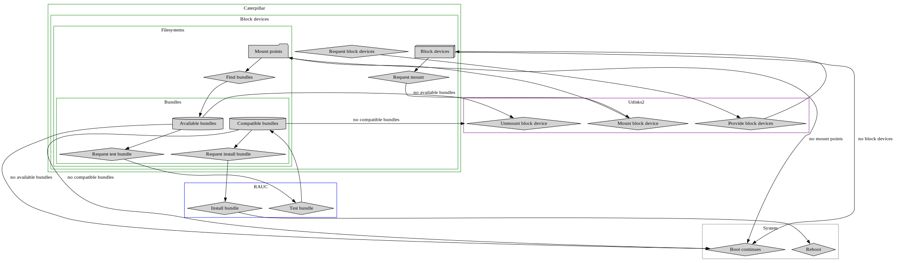

<!--
SPDX-FileCopyrightText: 2023 David Runge <dave@sleepmap.de>
SPDX-License-Identifier: CC-BY-SA-4.0
-->

# caterpillar

A tool for the detection and installation of RAUC update bundles found on attached block devices.

Caterpillar makes use of [dbus](https://gitlab.freedesktop.org/dbus/dbus) to communicate with
* [udisks2](https://github.com/storaged-project/udisks/) (for enumeration and (un)mounting of block devices)
* [RAUC](https://github.com/rauc/rauc/) (for validation and installation of update bundles)
* [logind](https://github.com/systemd/systemd) (for reboot after successful installation)

The application automatically detects all attached block devices and mounts them.

By default only compatible RAUC update bundles with a version higher than the current are considered and installed.
When making use of a (configurable) override directory, `caterpillar` is able to apply compatible bundles of any version (e.g. for downgrade scenarios).

When installation has been successful `caterpillar` unmounts all previously mounted devices and triggers a reboot of the machine (to boot into the other slot).

## Use-cases

A rough overview of `caterpillar`'s interaction with `rauc` and `udisks2` is outlined in the below diagram:



## Configuration

Some aspects of `caterpillar`'s behavior can be configured using a configuration file in `/etc/caterpillar/caterpillar.toml`.
An example configuration file with the defaults can be found in the `dist` directory of this repository.

## Update during Boot

Caterpillar can be run in the context of a systemd service during boot (an example unit file can be found in the `dist` directory of this repository).
In this mode the application will automatically (without user input):

* detect and mount all compatible block devices
* search and select one compatible update bundle
  * if a (top-level) override directory is found in the mountpoint, a singular update bundle from it is selected
  * if more than one update bundle exists in the (top-level) directory of the mountpoint, the one with the highest version is selected
* install the selected update bundle
* reboot

## Building

Caterpillar is written in [Rust](https://www.rust-lang.org/) and built using [cargo](https://doc.rust-lang.org/cargo/index.html):

```shell
cargo build --frozen --release --all-features
```

## Tests

Tests can be executed using

```shell
cargo test --all
```

## License

All code contributions are dual-licensed under the terms of the [Apache-2.0](https://spdx.org/licenses/Apache-2.0.html) and [MIT](https://spdx.org/licenses/MIT.html).
For further information on licensing refer to the contributing guidelines.

## Funding

This project has been made possible by the funding of [Nonlinear Labs GmbH](https://www.nonlinear-labs.de/).
